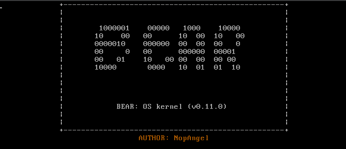

## BearOS

***BearOS***  is a kernel designed for both professionals and novices in the programming world. It has a very comfortable bash syntax and many tools necessary for development.

# IMPORTANT

***IMPORTANT***: This OS (kernel) is in beta (i.e. under development), which means it is not complete and lacks some tools. This kernel is not finished yet and will be constantly updated to provide a good service.

### FEATURES

You can take a look at the "docs" folder, as it contains some very fun BearOS stuff :)

## LICENSE

The license for this project is ***APACHE 2.0***, all contributions are open (Likewise, read and review the LICENSE)

#### WARNING
WARNING: This OS ***(Kernel)*** is inspired by ***GNU Unix/Linux***, but does not use any ***Unix/Linux code***, it is only inspired by the mentioned kernel.

### MORE INFORMATION:

#### KEYBOARD LANGUAGE: ENGLISH (UK)

### HOST: You can run the OS with: VIRTUAL BOX, QEMU, and VMWare (yes, or with their latest versions), and you can also run it on your machine with UEFI.

### How to support?

If you want to help, you can read the files in the **include** section, or even the **kernel.c** file itself. The comments contain information about what's done. (The bad thing is that the comments are in **Spanish**, but you can translate them with **Google Translate** or **Deepl**.)

## LICENSE and CONTRIBUTIONS.

This is a kernel, however, if you want to make a complete OS with this kernel, you can use it, but you will have to put in the ISSUES section of this repository, the name of the project you made, the URL, and so on (and also, give credits, however, you can read the LICENSE.md file, there it offers more detailed information about the license)

Created by: **NopAngel :)**
